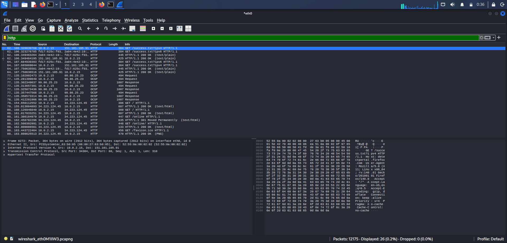
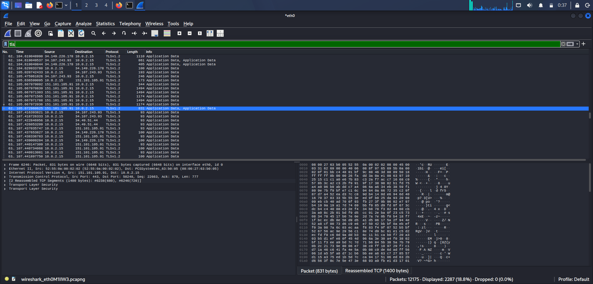
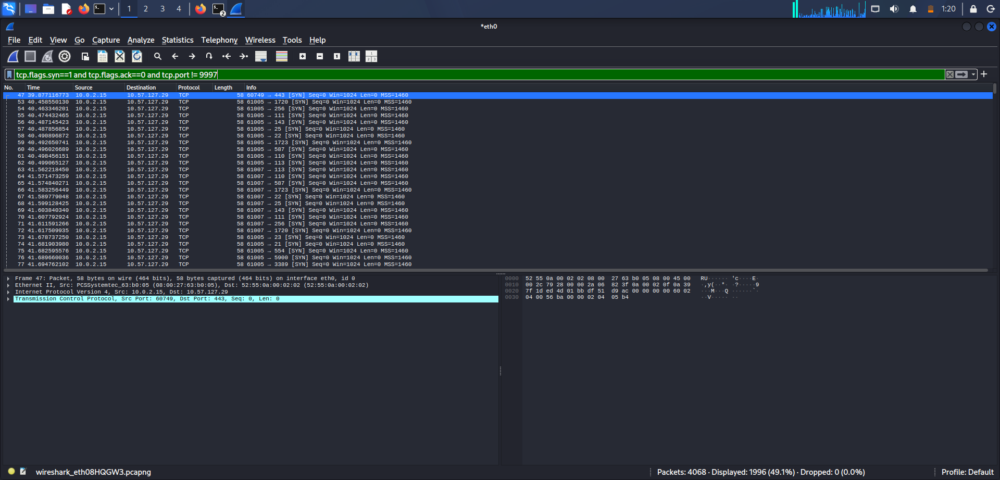

# Wireshark Packet Capture Analysis

`#SOC` `#Wireshark` `#NetworkAnalysis` `#CyberSecurity` `#BlueTeam`

Captured and analyzed live network traffic using Wireshark to distinguish
HTTP from HTTPS traffic and to identify the packet-level signature of a
port scan — a common reconnaissance technique used before an attack.

## Why This Matters

Packet-level analysis is a core SOC L1 skill. Being able to tell encrypted
from unencrypted traffic, and recognizing the pattern a port scan leaves
behind, helps an analyst quickly spot reconnaissance activity before it
turns into an actual intrusion attempt.

## Setup

- Captured live traffic on the `eth0` interface using Wireshark (Kali Linux VM)
- Generated normal browsing traffic (HTTP and HTTPS sites) for the first part
  of the analysis
- Simulated a port scan using `nmap` against a separate host machine on the
  same network, while capturing with Wireshark

## Analysis

### 1. HTTP Traffic
Filter used:
```
http
```
Identified unencrypted HTTP requests/responses — readable in plaintext,
confirming the traffic was not using TLS.



### 2. HTTPS / TLS Traffic
Filter used:
```
tls
```
Identified TLS handshake and encrypted application data, confirming the
traffic was encrypted end-to-end (no readable plaintext content visible).



### 3. Port Scan Detection
Simulated a port scan with:
```bash
sudo nmap -sS <target-host-ip>
```
Filter used to isolate the pattern:
```
tcp.flags.syn==1 and tcp.flags.ack==0 and tcp.port != 9997
```
**Observation:** A single source IP sent SYN packets to a single destination
IP, targeting a different destination port in each packet (443, 22, 3389,
25, 110, 111, 143, 587, 1720, 1723, 21, 554, 5900, etc.), all within
milliseconds of each other. This rapid, sequential probing of multiple
ports from one source is the classic signature of a port scan — the
reconnaissance phase an attacker uses to discover which services are
open on a target before attempting exploitation.



## What I Learned

- How to distinguish encrypted (TLS) from unencrypted (HTTP) traffic at
  the packet level in Wireshark
- The packet-level signature of a port scan: single source, single
  destination, many distinct destination ports, SYN flag only, in rapid
  succession
- How to write Wireshark display filters to isolate specific traffic
  patterns and filter out background noise
